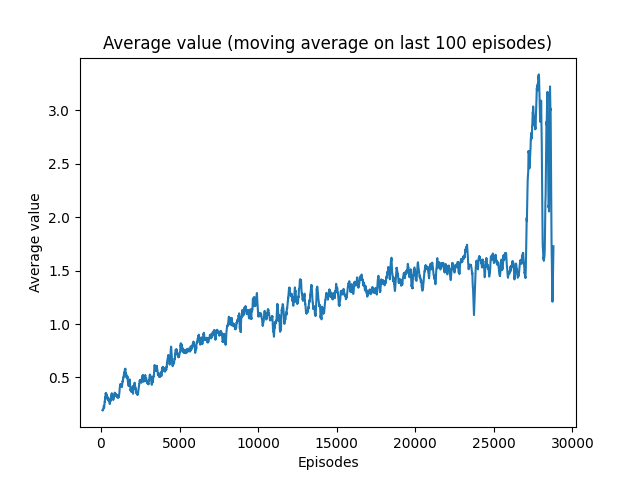
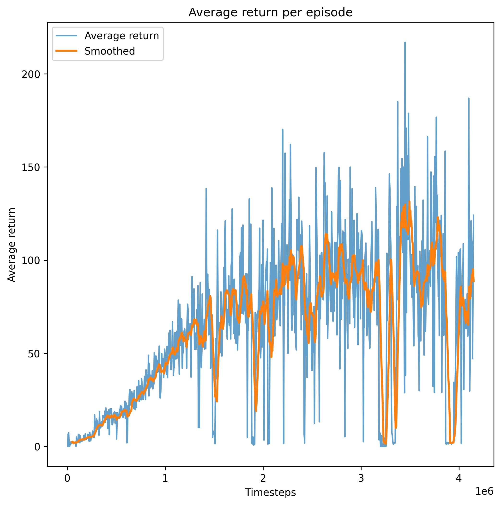

# Reinforcement Learning on simulated environments

This project aims to implement and compare various **Reinforcement Learning (RL)** algorithms to solve different simulated environments using the Gymnasium API.  
The experiments cover two main domains : 

- **Atari Games** ([Arcade Learning Environment](https://ale.farama.org/index.html))
- **Robotic Tasks** ([panda-gym](https://panda-gym.readthedocs.io/en/latest/) based on [PyBullet](https://pybullet.org/wordpress/) physics engine)

The implementations are based on the theoretical foundations presented in the book:

> Richard S. Sutton and Andrew G. Barto, *Reinforcement Learning: An Introduction*, 2nd Edition, MIT Press, 2018.  
> [http://incompleteideas.net/book/the-book-2nd.html](http://incompleteideas.net/book/the-book-2nd.html)

 

<h2>Table of Contents</h2>

- <h3><a href="#DQN">DQN for Pong</a></h3>
- <h3><a href="#A2C">A2C for Breakout</a></h3>
- <h3><a href="#SAC">SAC for Robotic tasks</a></h3>

 

<h2 id="DQN">1. DQN for Pong</h2>

 
This project implements a Deep Q-Learning (DQN) agent to play Atari Pong using Arcade Learning Environments (`ALE/Pong-v5`).  

The agent is trained with handcrafted features extracted from frames (ball position and velocity, paddles  positions, player velocity).  
Given the simplicity of the game, this approach is indeed very convenient as it allows the agent to access all relevant information from the raw frames while working with a much smaller and more manageable state space.

The sparsity of the rewards makes the training quite challenging. The agent indeed only receives a non-zero reward when it scores a point (+1) or when the opponent scores (-1). Naturally, such events occur only in a very small fraction of the timesteps experienced by the agent.

This project was originally inspired by the following paper :

> Volodymyr Mnih, Koray Kavukcuoglu, David Silver, Alex Graves, Ioannis Antonoglou, Daan Wierstra, and Martin Riedmiller,  
> *Playing Atari with Deep Reinforcement Learning*, arXiv preprint arXiv:1312.5602, 2013.  
> [https://arxiv.org/abs/1312.5602](https://arxiv.org/abs/1312.5602)

---
### 🎮 Demo

---

### 📌 Features

- Deep Q-Network (DQN) implementation in PyTorch
- Replay Buffer for experience replay (size = 50,000 )
- Target network for stable learning (update every 1,000 steps)
- Epsilon-greedy exploration strategy (ε from 1.0 → 0.05)
- Optimizer: Adam, learning rate = 1e-4
- Handcrafted state representation (paddle positions + player velocity + ball position and velocities)

---

### 📊 Results

**1. Training reward**  

  

This plot shows the evolution of the average reward per episode during training.  
We can see that the average reward obtained while training increased a lot in the first 1000 episodes, and then increased very slowly, stabilizing to small positive values.  
However, this doesn't mean that the agent stopped learning during the second half of training. Indeed, the low return values are not caused by bad performance from the agent, but instead by :

- The $\epsilon$-greedy policy used as the behaviour policy with a minimum value for $\epsilon$ of 0.1, leading to suboptimal actions 10% of the time.

- The timestep limit set to 10000 per episode, leading to truncated episodes and consequently truncated return

**2. Average Estimated Q_values**  

  

This plot shows the evolution of the average estimates Q_values $\hat{Q}(s,a)$ on a given set of states during training. ($y = \frac{1}{N_{states}} \sum_{s \in S} {\frac{1}{n_a}} \sum_{a \in A}{\hat{Q}(s,a)}$)

The state set used to compute this estimation has been sampled from $100$ independent episodes run with random policy. 

This plot shows the gradual improvement of the agent, both in estimating the state-action value function $Q_{\pi}(s,a)$ and improving the target policy $\pi$.
After initially overestimating the state-action values, the average estimation reduces to a more reasonable value (around 0.5) considering the scale of the values. Then, the esimation slowly increases as the behaviour policy approaches the optimal policy $\pi_*$

 

<h2 id="A2C">2. A2C for Breakout</h2>

 

This project implements an Advantage Actor-Critic (A2C) agent to play **Atari Breakout** using Arcade Learning Environments (`ALE/Breakout-v5`).  

The agent is trained using only the frames from the game, which are preprocessed according to the methodology presented in the following paper :

> Volodymyr Mnih, Koray Kavukcuoglu, David Silver, Andrei A. Rusu, Joel Veness, Marc G. Bellemare, Alex Graves, Martin Riedmiller, Andreas K. Fidjeland, Georg Ostrovski, Stig Petersen, Charles Beattie, Amir Sadik, Ioannis Antonoglou, Helen King, Dharshan Kumaran, Daan Wierstra, Shane Legg, and Demis Hassabis,  
> *Human-level control through deep reinforcement learning*, Nature, vol. 518, no. 7540, pp. 529–533, 2015.  
> [https://doi.org/10.1038/nature14236](https://doi.org/10.1038/nature14236)

The architecture of the network is also inspired from the work of DeepMind researchers. The same convolutional layers are used in the first part of the network. They are followed by a linear layer of 512 neurons with a ReLu activation. The actor is composed of a fully connected layer with as many neurons as possible actions. The critic in only one neuron connected to the former fully connected layer.

---
### 🎮 Demo

  

---

### 📜 Version History

- #### Version 1 :

The first version implemented the architecture of the Advantage Actor Critic (A2C) agent using convolutional layers to deal with raw frames input.  
The algorithm is optimized using Stochastic Gradient Descent with respect to the following loss function :

$$
\mathcal{L}(\theta, w) = 
- c_{actor} \mathbb{E}_{t} [ \log \pi_\theta(a_t \mid s_t) \, A_t ] 
+ \frac{1}{2} \, c_{critic} \mathbb{E}_{t} [ ( R_t - V_w(s_t) )^2 ] \ 
$$

$c_{actor}$ and $c_{critic}$ are hyperparameters adjusting the balance with the critic and the actor optimization. According to the literature, we used $c_{actor}=1$ and $c_{critic}=0.5$ throughout training.  

We train the agent using SGD with the Adam optimizer and a learning rate of $2.5 \times 10^{-4}$  

**Result** :  
Training is very slow, and never reaches average return above 10 (a few broken bricks) when evaluating the agent (greedy actions).

---

- #### Version 2:

This version improved the loss function to include an entropy term to encourage exploration :   
$- c_{entropy} \sum_a \pi_\theta(a|s) \log \pi_\theta(a|s)$  
We also added gradient clipping to avoid too large training steps and reduce the policy instability.  
Weights of the loss function have also been adjusted to make the actor more dominant over the critic.

**Result :**  
We achieve better performance, but average return seems to cap around an average return of 10 while training and 30 while evaluating. We tried reducing the entropy loss so that the agent starts exploiting more and learns to behave in longer episodes, but this made the policy very unstable. That is what we can see on the graphs after episode 27000. The agent quickly learned to exploit what is had already learned (same average return as in evaluation mode) but could not surpass this level and even experienced performance drop after a few episodes.

 

  
  

<b>Average return and value during training</b>

---

- #### Version 3:

This version added the handling of parallel environments to generate data. This multi-env setting greatly reduces the noise in the gradient estimates by lessening the correlation between samples. We can safely increase the batch size and speed-up the training process. To make it even faster, the whole code had been revised to handle GPU-computations, which are known to be very effective.

**Result :**  
As we can see on the graph, we manage to achieve greater performance with parallel environments (8 in this case). After 2M timesteps (8M game timesteps), the agent scores around 100 points per episode in evaluation (greedy) mode. However, training seems to become noisy after this point, and the policy never reacher stable better level.  

Even though the agent is still not able to completely solve the environment, it clearly achieves superhuman performance. Indeed, according to the DeepMind paper inspiring this work, the professional game tester level is around 31 per episode.  

  

<b>Average return during training</b>

Better performance may still be achievable with A2C, but would require hyperparameter tuning. But considering the very limited ressources available, this is beyond the scope of this project.  

The video shown in the DEMO section does not reflect the average performance of the model, as it one of the best recorded episodes. However it shows that the agent is able to achieve very good performance and discover interesting strategies. For example we can see that the agent learned to bounce the ball above the bricks in the late-game, collecting a lot of rewards. 

 

<h2 id="SAC">3. SAC for Robotic Tasks</h2>

This project aims to implement Soft-Actor-Critic to perform different basic tasks on a robotic arm. The environments and tasks are provided by the library <a href="https://panda-gym.readthedocs.io/en/latest/">panda-gym</a> that is built on <a href="https://pybullet.org/wordpress/">PyBullet</a> physics engine.  
The implementation of SAC is based on the original paper : 

> Tuomas Haarnoja, Aurick Zhou, Pieter Abbeel, Sergey Levine,  
> *Soft Actor-Critic: Off-Policy Maximum Entropy Deep Reinforcement Learning with a Stochastic Actor*,  
> *Proceedings of the 35th International Conference on Machine Learning (ICML)*,  
> vol. 80, pp. 1856–1865, 2018.  
> [https://proceedings.mlr.press/v80/haarnoja18b.html](https://proceedings.mlr.press/v80/haarnoja18b.html)

### 3.1 Reach Task

Work in progress...

 