# Reinforcement Learning on simulated environments

This project aims to implement and compare various **Reinforcement Learning (RL)** algorithms to solve different simulated environments using the Gymnasium API.  
The experiments cover two main domains : 

- **Atari Games** ([Arcade Learning Environment](https://ale.farama.org/index.html))
- **Robotic Tasks** ([panda-gym](https://panda-gym.readthedocs.io/en/latest/) based on [PyBullet](https://pybullet.org/wordpress/) physics engine)

The implementations are based on the theoretical foundations presented in the book:

> Richard S. Sutton and Andrew G. Barto, *Reinforcement Learning: An Introduction*, 2nd Edition, MIT Press, 2018.  
> [http://incompleteideas.net/book/the-book-2nd.html](http://incompleteideas.net/book/the-book-2nd.html)

 

<h2>Table of Contents</h2>

- <h3><a href="#DQN">DQN for Pong</a></h3>
- <h3><a href="#A2C">A2C for Breakout</a></h3>
- <h3><a href="#SAC">SAC for Robotic tasks</a></h3>

 

<h2 id="DQN">1. DQN for Pong</h2>

 
This project implements a Deep Q-Learning (DQN) agent to play Atari Pong using Arcade Learning Environments (`ALE/Pong-v5`).  

The agent is trained with handcrafted features extracted from frames (ball position and velocity, paddles  positions, player velocity).  
Given the simplicity of the game, this approach is indeed very convenient as it allows the agent to access all relevant information from the raw frames while working with a much smaller and more manageable state space.

The sparsity of the rewards makes the training quite challenging. The agent indeed only receives a non-zero reward when it scores a point (+1) or when the opponent scores (-1). Naturally, such events occur only in a very small fraction of the timesteps experienced by the agent.

This project was originally inspired by the following paper :

> Volodymyr Mnih, Koray Kavukcuoglu, David Silver, Alex Graves, Ioannis Antonoglou, Daan Wierstra, and Martin Riedmiller,  
> *Playing Atari with Deep Reinforcement Learning*, arXiv preprint arXiv:1312.5602, 2013.  
> [https://arxiv.org/abs/1312.5602](https://arxiv.org/abs/1312.5602)

---
### 🎮 Demo

  

<b>DQN Agent playing a full Pong Game</b>

---

### 📌 Features

- Deep Q-Network (DQN) implementation in PyTorch
- Replay Buffer for experience replay (size = 50,000 )
- Target network for stable learning (update every 1,000 steps)
- Epsilon-greedy exploration strategy (ε from 1.0 → 0.05)
- Optimizer: Adam, learning rate = 1e-4
- Handcrafted state representation (paddle positions + player velocity + ball position and velocities)

---

### 📊 Results

**1. Training reward**  

  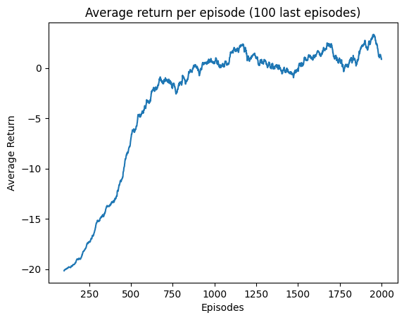

This plot shows the evolution of the average reward per episode during training.  
We can see that the average reward obtained while training increased a lot in the first 1000 episodes, and then increased very slowly, stabilizing to small positive values.  
However, this doesn't mean that the agent stopped learning during the second half of training. Indeed, the low return values are not caused by bad performance from the agent, but instead by :

- The $\epsilon$-greedy policy used as the behaviour policy with a minimum value for $\epsilon$ of 0.1, leading to suboptimal actions 10% of the time.

- The timestep limit set to 10000 per episode, leading to truncated episodes and consequently truncated return

**2. Average Estimated Q_values**  

  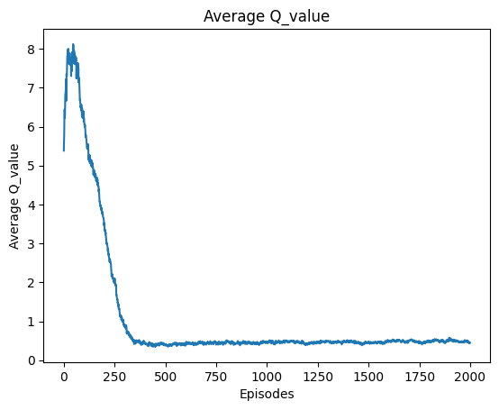

This plot shows the evolution of the average estimates Q_values $\hat{Q}(s,a)$ on a given set of states during training. ($y = \frac{1}{N_{states}} \sum_{s \in S} {\frac{1}{n_a}} \sum_{a \in A}{\hat{Q}(s,a)}$)

The state set used to compute this estimation has been sampled from $100$ independent episodes run with random policy. 

This plot shows the gradual improvement of the agent, both in estimating the state-action value function $Q_{\pi}(s,a)$ and improving the target policy $\pi$.
After initially overestimating the state-action values, the average estimation reduces to a more reasonable value (around 0.5) considering the scale of the values. Then, the esimation slowly increases as the behaviour policy approaches the optimal policy $\pi_*$

 

<h2 id="A2C">2. A2C for Breakout</h2>

 

This project implements an Advantage Actor-Critic (A2C) agent to play **Atari Breakout** using Arcade Learning Environments (`ALE/Breakout-v5`).  

The agent is trained using only the frames from the game, which are preprocessed according to the methodology presented in the following paper :

> Volodymyr Mnih, Koray Kavukcuoglu, David Silver, Andrei A. Rusu, Joel Veness, Marc G. Bellemare, Alex Graves, Martin Riedmiller, Andreas K. Fidjeland, Georg Ostrovski, Stig Petersen, Charles Beattie, Amir Sadik, Ioannis Antonoglou, Helen King, Dharshan Kumaran, Daan Wierstra, Shane Legg, and Demis Hassabis,  
> *Human-level control through deep reinforcement learning*, Nature, vol. 518, no. 7540, pp. 529–533, 2015.  
> [https://doi.org/10.1038/nature14236](https://doi.org/10.1038/nature14236)

The architecture of the network is also inspired from the work of DeepMind researchers. The same convolutional layers are used in the first part of the network. They are followed by a linear layer of 512 neurons with a ReLu activation. The actor is composed of a fully connected layer with as many neurons as possible actions. The critic in only one neuron connected to the former fully connected layer.

---
### 🎮 Demo

  

<b>A2C Agent playing a full Breakout Game</b>

---

### 📜 Version History

- #### Version 1 :

The first version implemented the architecture of the Advantage Actor Critic (A2C) agent using convolutional layers to deal with raw frames input.  
The algorithm is optimized using Stochastic Gradient Descent with respect to the following loss function :

$$
\mathcal{L}(\theta, w) = 
- c_{actor} \mathbb{E}_{t} [ \log \pi_\theta(a_t \mid s_t) \, A_t ] 
+ \frac{1}{2} \, c_{critic} \mathbb{E}_{t} [ ( R_t - V_w(s_t) )^2 ] \ 
$$

$c_{actor}$ and $c_{critic}$ are hyperparameters adjusting the balance with the critic and the actor optimization. According to the literature, we used $c_{actor}=1$ and $c_{critic}=0.5$ throughout training.  

We train the agent using SGD with the Adam optimizer and a learning rate of $2.5 \times 10^{-4}$  

**Result** :  
Training is very slow, and never reaches average return above 10 (a few broken bricks) when evaluating the agent (greedy actions).

---

- #### Version 2:

This version improved the loss function to include an entropy term to encourage exploration :   
$- c_{entropy} \sum_a \pi_\theta(a|s) \log \pi_\theta(a|s)$  
We also added gradient clipping to avoid too large training steps and reduce the policy instability.  
Weights of the loss function have also been adjusted to make the actor more dominant over the critic.

**Result :**  
We achieve better performance, but average return seems to cap around an average return of 10 while training and 30 while evaluating. We tried reducing the entropy loss so that the agent starts exploiting more and learns to behave in longer episodes, but this made the policy very unstable. That is what we can see on the graphs after episode 27000. The agent quickly learned to exploit what is had already learned (same average return as in evaluation mode) but could not surpass this level and even experienced performance drop after a few episodes.

 

  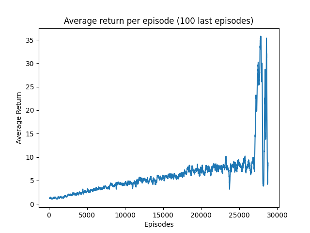
  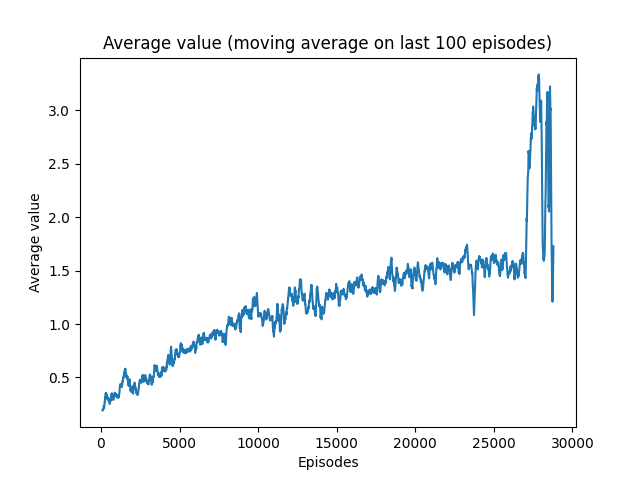

<b>Average return and value during training</b>

---

- #### Version 3:

This version added the handling of parallel environments to generate data. This multi-env setting greatly reduces the noise in the gradient estimates by lessening the correlation between samples. We can safely increase the batch size and speed-up the training process. To make it even faster, the whole code had been revised to handle GPU-computations, which are known to be very effective.

**Result :**  
As we can see on the graph, we manage to achieve greater performance with parallel environments (8 in this case). After 2M timesteps (8M game timesteps), the agent scores around 100 points per episode in evaluation (greedy) mode. However, training seems to become noisy after this point, and the policy never reacher stable better level.  

Even though the agent is still not able to completely solve the environment, it clearly achieves superhuman performance. Indeed, according to the DeepMind paper inspiring this work, the professional game tester level is around 31 per episode.  

  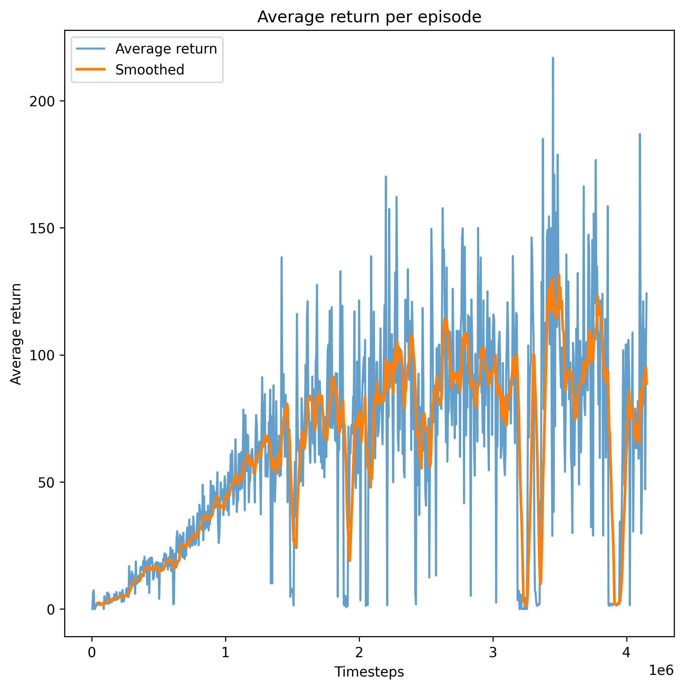

<b>Average return during training</b>

Better performance may still be achievable with A2C, but would require hyperparameter tuning. But considering the very limited ressources available, this is beyond the scope of this project.  

The video shown in the DEMO section does not reflect the average performance of the model, as it one of the best recorded episodes. However it shows that the agent is able to achieve very good performance and discover interesting strategies. For example we can see that the agent learned to bounce the ball above the bricks in the late-game, collecting a lot of rewards. 

 

<h2 id="SAC">3. SAC for Robotic Tasks</h2>

This project aims to implement Soft-Actor-Critic to perform different basic tasks on a robotic arm. The environments and tasks are provided by the library <a href="https://panda-gym.readthedocs.io/en/latest/">panda-gym</a> that is built on <a href="https://pybullet.org/wordpress/">PyBullet</a> physics engine.  
The implementation of SAC is based on the original paper : 

> Tuomas Haarnoja, Aurick Zhou, Pieter Abbeel, Sergey Levine,  
> *Soft Actor-Critic: Off-Policy Maximum Entropy Deep Reinforcement Learning with a Stochastic Actor*,  
> *Proceedings of the 35th International Conference on Machine Learning (ICML)*,  
> vol. 80, pp. 1856–1865, 2018.  
> [https://proceedings.mlr.press/v80/haarnoja18b.html](https://proceedings.mlr.press/v80/haarnoja18b.html)  

 

Following the architecture proposed in this paper, all 5 networks (Actor, both Q-value Critics, Value and Target Value Critics) have 2 hidden layers each with 256 neurons.  
- The Actor outputs Gaussian means and variances given the state (joints position) and a target goal
- Q-value Critics output a scalar given the state, goal and sampled action
- Value Critics output a scalar given the state and goal

As the Critics can be optimized **off-policy**, we also use a Replay Buffer.

 

Each task is available in different versions, with two main differences : 
- **Sparse or Dense rewards** : Whether the agent only receives positive rewards after completing the task or continuoulsy throughout the episode depending on how close it is of completing the task (for example distance to target)
- **End-effector or Joints control** : Whether the agent acts directly on the end-effector displacement (xyz displacement) or on the individual motion of each joint

 

Throughout this project, we will focus on the sparse rewards settings. This makes the tasks considerably more challenging as the agent does not receive any useful feedback untils it manages to complete the task by chance. However, this very general-purpose framework avoids the complicated task of engineering an approproate dense reward function that would bias the agent learning process. using sparse rewards, we let the agent explore the environment and discover by itself an optimal strategy (potentially better than the one we would have pushed it towards with dense rewards)  
We will also focus on the joints control settings as it is more realistic than end-effector control. To use the latter on a physical robot, we would need a very precise model of the robotic arm movements, which in general we don't have. We hence remain in a model-free approach.

 

### 3.1 Reach Task
 
For the **Reach** task, the robotic arm has 6 degrees-of-freedom, corresponding to the 6 free joints (the grip is locked in closed position). Hence the action space has 6 dimensions in the joints control version. The observation space contains the position of the 6 joints as well as the target goal (ie. the point to reach). The "achieved goal" (the actual position of the end-effector) is also given, but we will not use it, as it can be derived from the joints position. The agent will have to learn this non-linear relation by itself.  

We set the maximum episode length to 200 timesteps. Training starts after 20000 warmup timesteps. The agent is evaluated every 2000 timesteps by averaging return and success rate on 10 episodes run with deterministic policy (using the means outputted by the Actor)

**Result :**  

  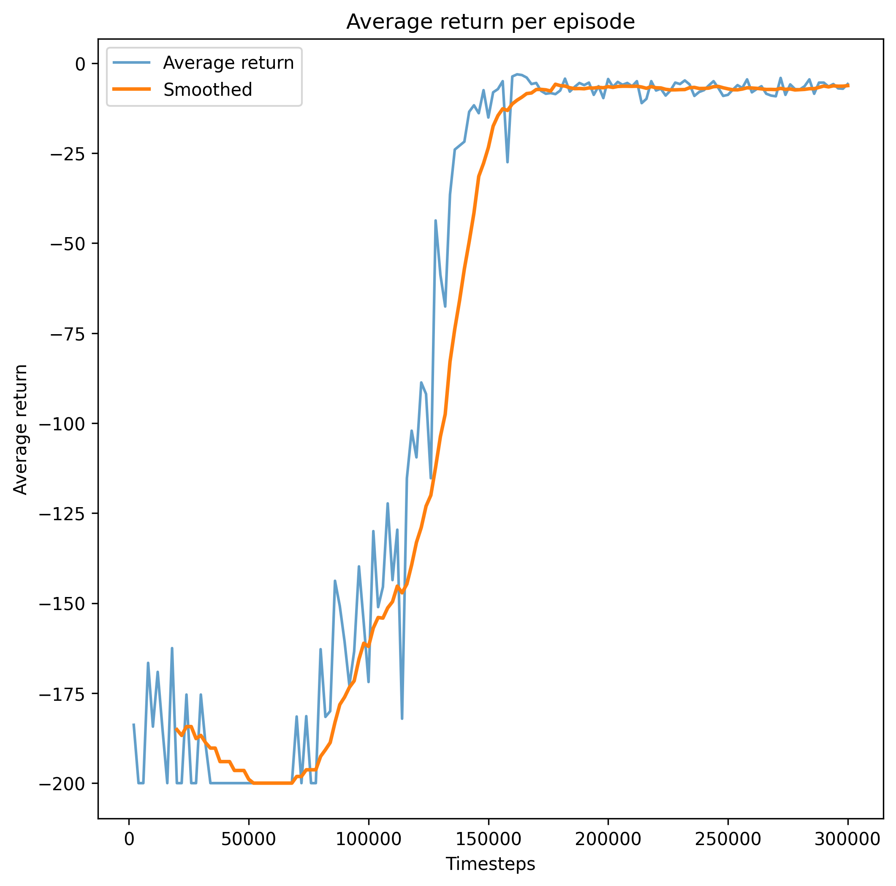
  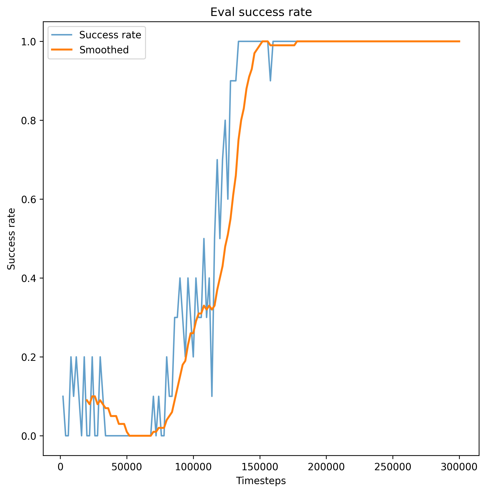

<b>Success rate and average return throughout training</b>

 

  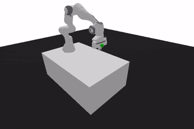

<b>Agent performing 50 episodes with 100% success rate after training</b>

### 3.1 Push Task

For the **Push** task, the goal for the robotic arm is to move a cube to a target position. Its grip is still locked, so it should do so by simply pushing it towards the desired position. You can see an example of this task with the target position shown as the transparent green cube : 

  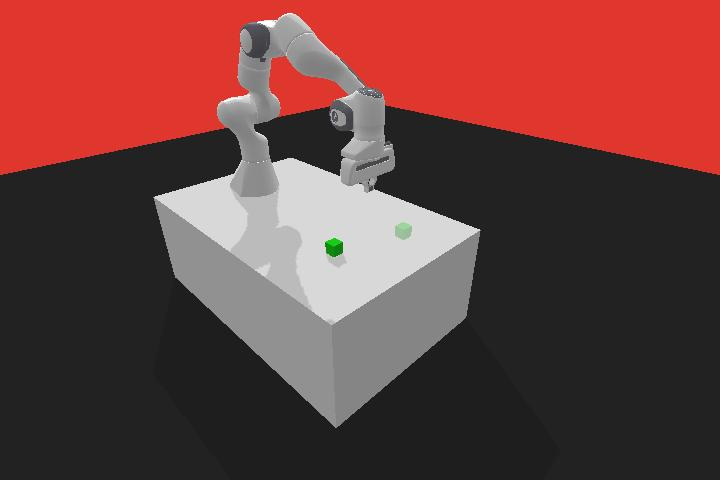

<b>Example of the initial setting of an episode for the Push task</b>

We first tried to train our agent with SAC in the same conditions as the one used previously for the **Reach** task. However, because of the greater difficulty of the task, the agent did not manage to learn a proper strategy and its success rate never increased. This was expected considering the sparsity of the rewards on such a difficult task. While on **Reach** the agent was able to sometimes achieve the target goal by chance when performing random actions, it is very unlikely on this task, because on top of reaching a particular point (the cube), the end-effector now also has to push the cube in the right direction, consistently enough so that it can reach the target destination and receive positive reward.  

To tackle the challege of reward sparsity, we implemented **Hindsight Experience Replay**, based on the paper by OpenAI : 

> Marcin Andrychowicz, Filip Wolski, Alex Ray, Jonas Schneider, Rachel Fong, Peter Welinder, Bob McGrew, Josh Tobin, OpenAI, Pieter Abbeel, Wojciech Zaremba,  
> *Hindsight Experience Replay*,  
> *Advances in Neural Information Processing Systems (NeurIPS)*,  
> vol. 30, pp. 5048–5058, 2017.  
> [https://proceedings.neurips.cc/paper/2017/hash/453fadbd8a1a3af50a9df4df899537b5-Abstract.html](https://proceedings.neurips.cc/paper/2017/hash/453fadbd8a1a3af50a9df4df899537b5-Abstract.html)

The motivation behind **Hindsight Experience Replay** (HER) comes from a simple realization : when training an agent in a multi-goal settings with binary sparse rewards, the agent only exploits trajectories that lead to success. If the task is very complex and we do not insert any prior knowledge to the agent, the proportion of these successful trajectories among all generated trajectories can be extremely small or even null. In other words, the reward signal is constant, and hence doesn not contain any information helping the agent understanding the environment and the task.
However, we could also consider that even the unsuccessful trajectories contain valuable information about the environment dynamics. Even if a certain sequence of actions did not lead the agent to the initial target, it has lead it somewhere, to a particular state. And maybe that if the agent could learn this relation, this causality, it would benefit its learning process about how to reach the actual target. 
From this general idea, the concept of Hindsight Experience Replay is to augment our dataset of experienced trajectories by creating new samples with a modified target goal and a recomputed reward. From a tuple $(state, goal, action, reward, next \space state)$, we can generate a new tuple $(state, new \space goal, action, new \space reward, next \space state)$ that we can store alongside the "real" tuples in our Replay Buffer. As long as we are able to compute accurately this $new reward$, this tuple is exactly as valid as the original one. Indeed, the goal does not impact the environment dynamics, only the policy, but because we are learning off-policy this is not a problem. 
In practice, different strategies are possible to create these "artificial" successful trajectories. The simplest one is to consider the terminal state of the episode as the new target. We can then replay the entire rollout by changing the original goal to this new one and recomputing the reward that the agent would have obtained at each timestep with this target. The new goal can also be sampled from the states visited later in the trajectory, or even sampled from the states visited during the whol training procedure
HER is particularly relevant in the multi-goal settings we are working in, as the target goal is randomly initialized, and could indeed have been the final state reached by the agent. But researchers even shown that this method could also benefit the traning process in a single-goal context. In this case, HER could be considered as an implicit Curriculum Learning method.
 
To first assess the benefits of HER, we tried comparing the learning process in the **Reach** with and without Hindsight Experience replay. The results are shown below.

  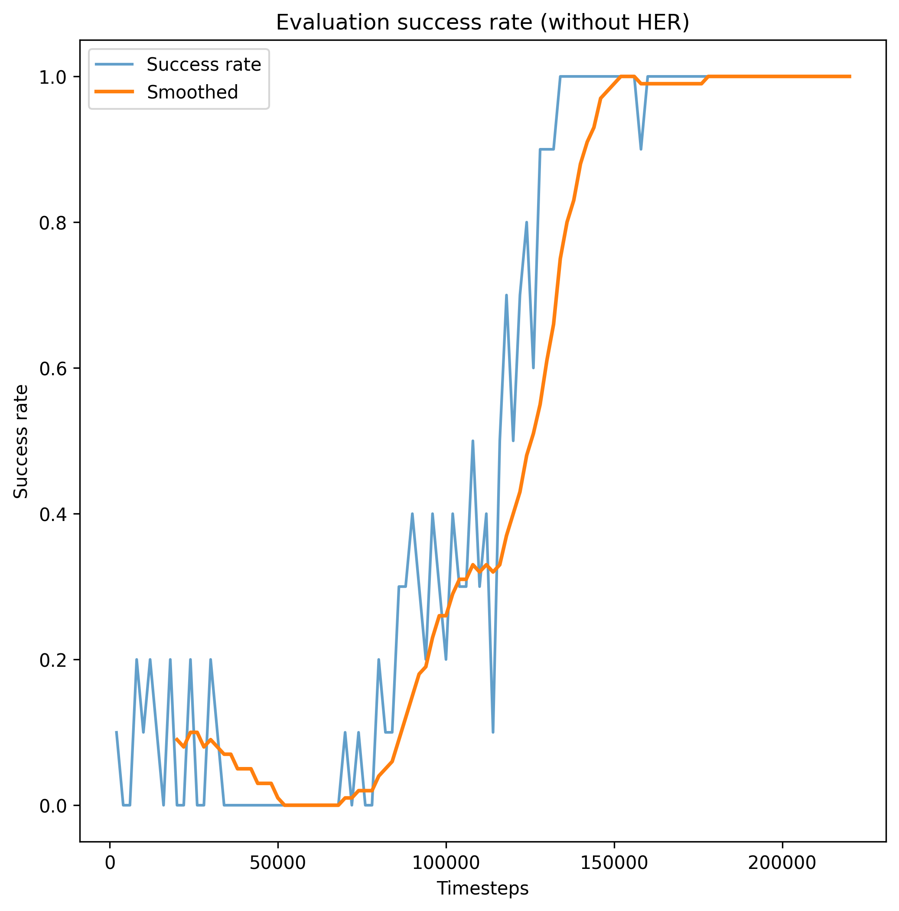
  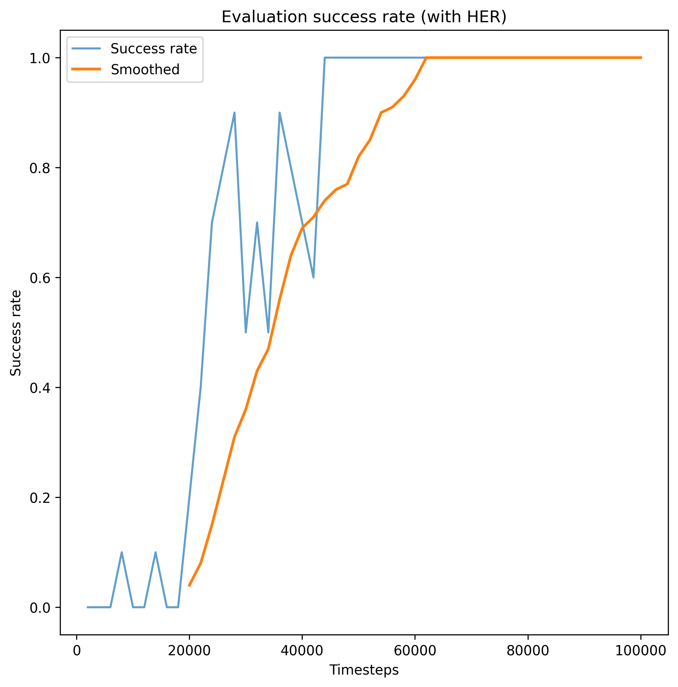

<b>Comparaison of success rate during training with and without HER</b>

We can see that using HER, the agent learned very quickly a good policy after the initial 20000 warmup timesteps. It reached a 100% success rate in only 50000 timesteps, contrary to the agent without HER that needed approximately 3 times longer. On this task, HER greatly improves sample-efficiency

Unfortunately, in the same conditions, HER alone did not enable the agent to successuly learn the **Push** task. After more than 1M timesteps, the agent didn't show any sign of improvement and remained at a 0% success rate. As this task is significantly more challenging than **Reach**, maybe the agent would need even more time to explore sufficiently the environment. Intituively, the benefits of HER are also less important than on the previous task as the final state used as the new target goal is the position of the cube instead of the position of the arm. Hence the relation between the actions performed by the agent throughout the episode and this final state is not direct and harder to interpret. Very ofter they are even independant as the robotic arm may never touch the cube during the episode. In this case, the arfificial trajectories contain the information that placing the cube at that particular position with that particular target lead to a positive reward, but not what sequence ections to perform to achieve such result. Our methodology probably should be revised if we want to solve challenging tasks as this one.

 